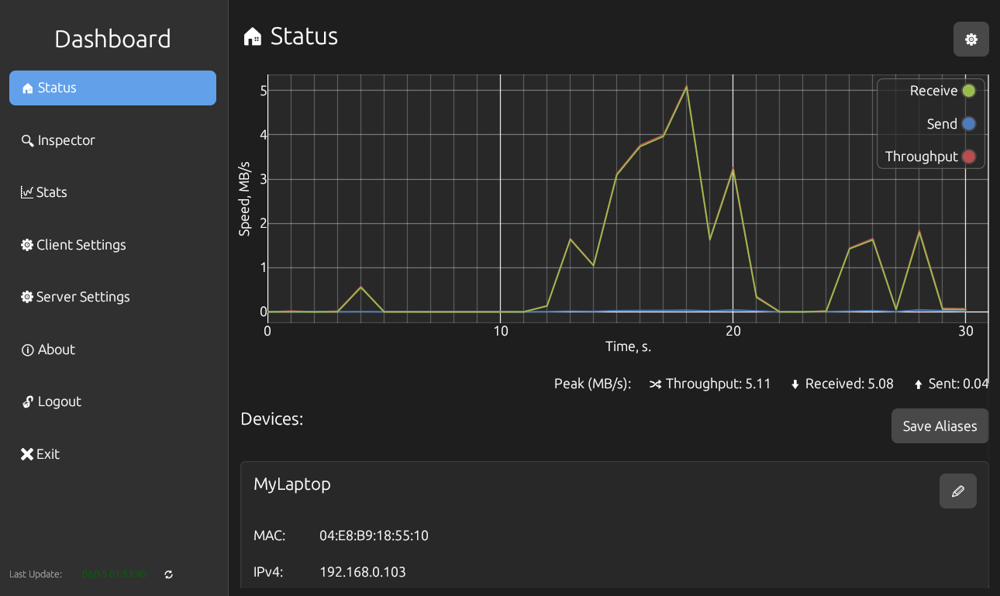
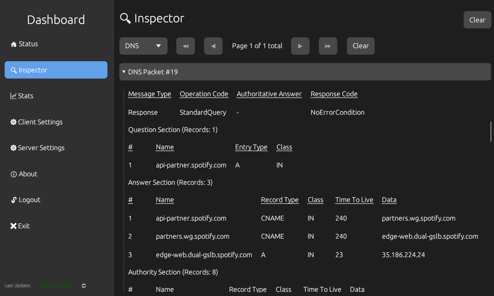

# xailyser

**Rust-based**🦀 project implementing Deep Packet Inspection (DPI) in Rust,
consisting of a core library, a server, and a desktop client, serving as a
foundational platform for adding custom protocols.


---

### 🚀 Project Overview

**xailyser** is designed as a diploma project that splits into three Rust components:
- **DPI Library:** A core Rust crate providing packet capture and protocol parsing functionality. It is the foundation for extending new or custom protocols.
- **Server:** A backend application using the DPI library to capture packets via `libpcap`, analyze traffic, aggregate statistics, and expose a WebSocket API streaming JSON frames.
- **Client:** A cross-platform desktop UI (Windows, Linux, macOS) visualizing overall traffic statistics and charts in real time.

This modular structure makes it easy to add new protocols, swap out components, or integrate into other systems.



### 🔍 Key Features
- **Extensive Settings:** compression levels, localization, themes, and more
- **Server Configuration:** choose network interfaces, set access password
- **Protocol Inspector:** built‑in support for 12 protocols in version 1.0.0
- **Traffic Statistics:** overall byte and packet counters with real‑time charts
- **User Profiles:** login profiles for multiple devices
- **Device Aliases:** assign friendly names to MAC addresses
- **OUI Detection:** vendor lookup via Wireshark OUI database
- **Port Detection:** service identification using IANA port database
- **Packet Details:** view detailed metadata and payload info for each packet
- **Extensible DPI Library:** foundation for adding custom protocol parsers

And more: **heartbeat system**, **logging**, etc.



### 🛠️ Technology Stack

| **Component**         | **Description**                    |
|-----------------------|------------------------------------|
| Programming Languages | Rust, bash, powershell             |
| Packet Capture        | libpcap                            |
| Parsing               | nom                                |
| Data Enrichment       | Wireshark OUI DB + IANA port DB    |
| Server Concurrency    | std::thread + `crossbeam` channels |
| Communication         | WebSocket, `tungstenite-rs`        |
| UI Library            | egui                               |
| Themes                | egui-aesthetix                     |

**Available Protocols**: Arp, DHCP v4/v6, DNS, Ethernet II, HTTP, ICMP v4/v6, IP v4/v6, TCP, UDP.


### 📦 Precompiled Binaries

Precompiled binaries for Windows, Linux and MacOS can be found in the [latest releases](https://github.com/xairaven/xailyser/releases/latest).

### 🔨 Building from Source

1. Ensure you are using the latest stable version of Rust:
   ```bash
   rustup update
   ```

2. Build and run the application:
   ```bash
   cargo run --package client --release
   cargo run --package server --release
   ```

If you are using **Windows**, download the **[WinPcap Developer's Pack](https://www.winpcap.org/devel.htm)**. You will need the `Packet.lib` file, which is located in `WpdPack/Lib/x64/`.

There are a couple of ways to link it:
- Set the `LIB` environment variable to the path of this file.
- Projects include a special `build.rs` files. They specify the search for libraries to link in the `lib` directory, if such a directory exists at the root of the workspace.
- **A less recommended option:** add the file to the *toolchain libraries*. An example path is:

```
C:\Users\<Your-User>\.rustup\toolchains\<Your-Toolchain>\lib\rustlib\<Same-Toolchain>\lib\Packet.lib
```

### ⚠️ Running on Windows:
You'll likely need to install [Npcap](https://npcap.com/#download). During installation, make sure to check the option "Install Npcap in WinPcap API-compatible Mode."

### ⚠️ Running on Linux:
`libpcap` is already installed on most Linux distros. But to avoid running the program under `sudo` every time, you may have to grant privileges:

```bash
sudo setcap CAP_NET_RAW+ep /path/to/server
```


**Encounter any issues?** Feel free to open an issue (or make a **pull-request**), and I'll likely help you out.

### 📌 Additional Dependencies (Linux)

On Linux systems, you may need to install the following dependencies:

   ```bash
   sudo apt install libpcap-dev libxcb-render0-dev libxcb-shape0-dev libxcb-xfixes0-dev libxkbcommon-dev libssl-dev
   ```

### 📌 Additional Dependencies (Fedora)

On Fedora systems, you may need to install:

   ```bash
   dnf install libpcap-dev clang clang-devel clang-tools-extra libxkbcommon-devel pkg-config openssl-devel libxcb-devel gtk3-devel atk fontconfig-devel
   ```

### 📰 License

This project is licensed under the [GPL-3.0 License](LICENSE).

### 🎆 Contributing

Contributions are welcome! Please fork the repository and create a pull request with your changes.

